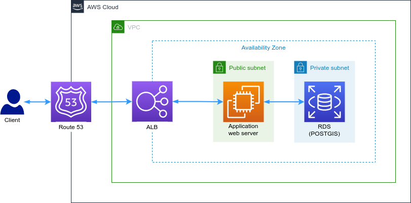

# Overview
This project is a walkthrough that guides users to creating a simple django application (a reverse geocoder in this case) and how to deploy it on AWS. This README contains:
* Architectural design
* Getting started
* CloudFormation guide
* Reference
* Consulting

The project utilizes the following tools

## 1. Architectural designs

### *General Architecture*
TODO
### *AWS architecture*
#### AWS Workload components
* Route53: An A record routing traffic to the ALB will be used to access the application.
* Application Load Balancer (ALB): The load balancer forwarding traffic to the application server.
* EC2: Compute instance hosting the django application and an Nginx web server.
* RDS: A PostgreSQL database extended with POSTGIS to enable spatial data management.



## 2. Getting Started
#### Database setup
Start by creating a normal RDS (PostgreSQL) database and extend it with a POSTGIS extension using the following commands
```code
CREATE EXTENSION postgis;
CREATE EXTENSION postgis_topology;
``` 

Finally, ensure to transfer ownership of the objects to the rds superuser role.

#### EC2 instance setup
Launch an Ubuntu 20 EC2 instance on AWS using a small instance type because the application is small. Connect to the  EC2
instance using an SSH client. Now configure the inbound rules of the instance security group to allow custom TCP traffic
on port 8000, SSH on port 22 and HTTP on port 80. Ensure the instance is upto date and install the project prerequisites using the following
commands
```code
$ sudo apt-get install python3-venv
$ sudo apt-get install binutils libproj-dev gdal-bin
```

#### Django application setup
If EC2 setup is succesfull, clone the project to a location of your choice (i.e home or opt folder) and transfer data folder to the ***geocoder_proj/reverse_geo*** using an SCP client.
Now create a virtual environment and install the required packages as shown:
```code
$ python3 -m venv ~/env
$ . ~/env/bin/activate
$ cd ~/geocoder_proj
$ pip install -r geocoder/requirements.txt
```

Export the following variables ```SECRET_KEY, DJANGO_ALLOWED_HOSTS, DJANGO_DEBUG, GEODOCDER_DATABASE, DJANGO_DATABASE_USER,
 DJANGO_DATABABASE_PASS, DJANGO_DATABASE_HOST``` and ```DJANGO_DATABASE_PORT``` to the OS environment. Run the following
 commands to complete the django project setup:
 
 ```code
$ python geocoder/manage.py migrate
$ python geocoder/manage.py shell
>>> from reverse_geo import load
>>> load.run()
```
Verify that the project works using by starting the development server and test the reverse geocoder by goint to 
http://INSTANCE_IP_ADDRESS:8000/api/v1/wards/get_admin/?lat=1.0344&long=37.567.

#### Gunicorn setup
TODO
#### Nginx setup
TODO
## 3. CloudFormation guide
TODO
## 4. References
This project would not be a success without the help fo the following materials:
* [Installing geospatil libraries - Goedjango guide](https://docs.djangoproject.com/en/3.2/ref/contrib/gis/install/geolibs/)
* [GeoDjango Tutorial](https://docs.djangoproject.com/en/3.2/ref/contrib/gis/tutorial/)
* [Tutorial: Get started with Amazon EC2 Linux instance](https://docs.aws.amazon.com/AWSEC2/latest/UserGuide/AccessingInstancesLinux.html)

## 5. Training and Consulting
I do offer remote and on-site training to individuals and teams on Django and AWS Services. Any setup that you need help with?
I also offer Django and AWS consultancy services. Let us develop and deploy your project!